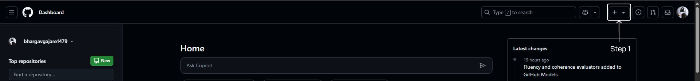
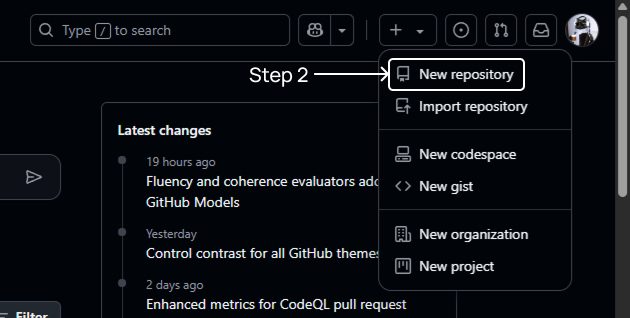
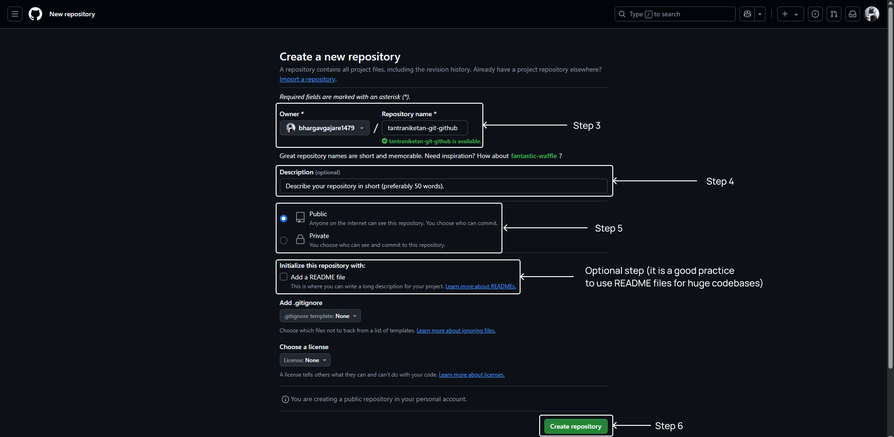
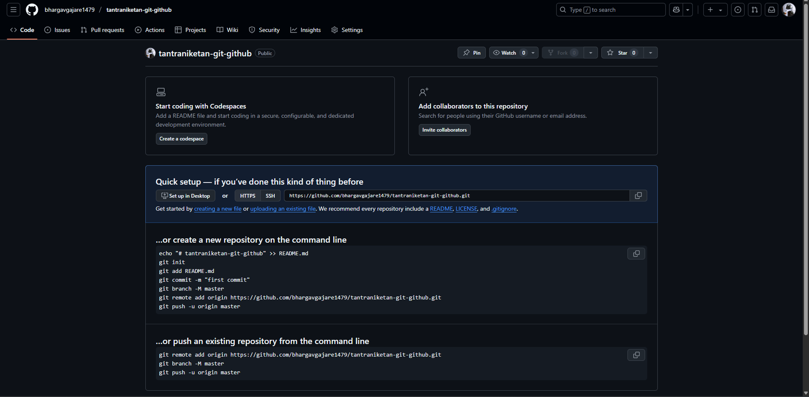

# Introduction to Version Control Systems

A **Version Control System (VCS)** is a software tool that helps developers track and manage changes to source code over time. Every change—be it adding a feature, fixing a bug, or restructuring the entire project—is recorded by the VCS, allowing developers to review history, revert to previous states, and collaborate safely with others.

## Key Features of Version Control Systems

- **History Tracking**: Every modification is stored with metadata, including the author, timestamp, and changes made.
- **Collaboration**: Multiple developers can work together on the same project without overwriting each other’s changes.
- **Branching and Merging**: Developers can create isolated lines of development and later combine them with the main codebase.
- **Backup and Recovery**: Provides the ability to revert to a previous working state if needed.

## Types of Version Control Systems

Version control systems can be broadly classified into three categories:

### Local Version Control System

All versioned files and history are stored on the **local machine**. This setup is simple and fast, ideal for solo projects. However, it lacks collaboration support and is vulnerable to data loss if the local system fails.

In this model, every developer manages and versions files only within their local system—there is no remote server involved.

### Centralized Version Control System

A **central server** holds the main repository, and clients access files from it. This model provides:

- Centralized backup
- Easier administration
- Unified access control

However, since all commits directly affect the central repository, unintentional changes may impact the shared codebase.

### Distributed Version Control System

Each developer maintains a **full copy** of the entire repository, including the complete history, on their local machine. Developers can:

- Commit locally without affecting the remote repository
- Push to and pull from the remote repository as needed

This is the most commonly used version control approach today due to its flexibility and robustness.

---

# Git

**Git** is a free, open-source distributed version control system created by Linus Torvalds in 2005 for Linux kernel development. It emphasizes speed, data integrity, and non-linear development workflows.

## Commonly Used Terms in Git

- **Repository (Repo)**: A directory where your project files and their history are stored.
- **Commit**: A snapshot of your project at a given time, identified by a unique SHA-1 hash.
- **Branch**: A separate line of development for testing features or fixing bugs.
- **Merge**: Integrating changes from one branch into another.
- **Clone**: Creating a local copy of a remote repository.
- **Remote**: A reference to a repository hosted elsewhere (e.g., on GitHub).

## Installing Git

You can install Git by visiting the [official Git website](https://git-scm.com/) and downloading the appropriate version for your operating system.

Alternatively, you can install Git via the command line:

### Windows

```bash
winget install --id Git.Git -e --source winget
```

### Linux

```bash
sudo apt install git
```

### macOS

```bash
brew install git
```

## Configuring Git Credentials

After installation, configure Git with your username and email:

```bash
git config --global user.name "your-username"
git config --global user.email "user@example.com"
```

Replace the placeholders with your actual GitHub username and email.

---

# GitHub

**GitHub** is a web-based platform built around Git, owned by Microsoft. It provides both public and private Git repository hosting along with powerful tools for collaboration, code review, project management, and automation.

GitHub acts as a central place where developers can store and share code with version control. It enables collaboration through pull requests and code reviews, and it provides tools such as issues, discussions, and project boards for managing software development workflows. GitHub also supports:

- Hosting documentation and websites using GitHub Pages
- Automating workflows using GitHub Actions

---

# Key Differences Between Git and GitHub

| Feature     | Git                                            | GitHub                                                      |
|------------|------------------------------------------------|-------------------------------------------------------------|
| **Type**    | Command-line tool                              | Web-based platform                                          |
| **Role**    | Version control system                         | Git repository hosting and collaboration                   |
| **Usage**   | Local or with any remote repository            | Hosting service for Git repositories                       |
| **Interface** | Command Line Interface (CLI)                 | Web UI, Desktop App, CLI                                   |
| **Storage** | Decentralized (each user has full repo)        | Centralized hosting of repositories                        |

> Git works independently of GitHub. GitHub is simply one of many platforms where you can host Git repositories online.

---

# Creating Your First Repository











